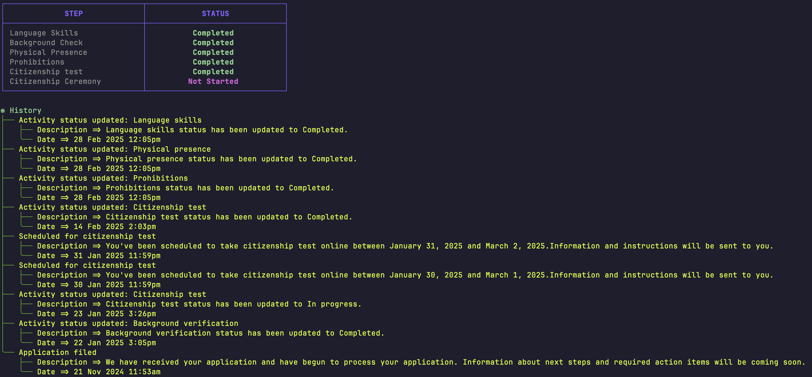

# Citizenship Tracker CLI

The Citizenship Tracker CLI is a powerful command-line tool designed to help users track their citizenship application status effortlessly. With seamless integration and automated updates, users can stay informed about their application progress in real-time.

**Why This Project Exists:** The main reason for creating this project is that the government takes 2 to 3 days to send an email after the update is ready. This tool helps users get timely updates without waiting for the official email.

## Feature

- Real-time Status Tracking: Instantly check the status of your citizenship application.
- Automated Updates: Schedule automatic status checks every 3 hours.
- Easy Installation: Simple Homebrew tap setup for quick installation and updates.




## Installation

```shell
brew tap mendesbarreto/citizenship
brew install citizen
```

## Usage

Check your citizenship application status:

```shell
citizen run --status
#or
citizen run --headless
```

Run automatically every 3 hours:

```shell
brew services start citizen
```

## Contributing

We welcome contributions to improve the Citizenship Tracker CLI. Here are some ways you can contribute:

- Reporting issues and bugs
- Submitting pull requests to fix bugs or add features
- Improving documentation

